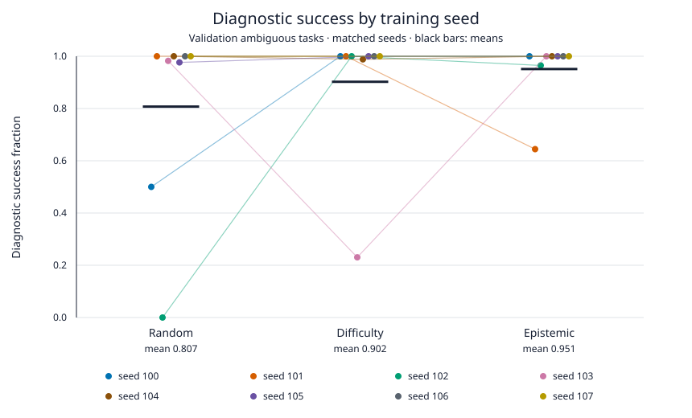

# Faultline

Faultline is a small synthetic factory-diagnosis simulator for studying when reinforcement-learning agents investigate before repairing.

**Question:** Does training only on tasks that need an experiment teach better diagnosis than random or difficulty-adaptive curricula?

Two hidden faults produce identical initial symptoms but need opposite repairs; advancing the factory and inspecting it distinguishes them ([task generator](src/faultline/generation/diagnostic_pairs.py)). A graph encoder and recurrent policy learn with PPO, GAE and clipped objectives, rewarded for production minus operating costs, not information gain ([trainer](src/faultline/training/ppo.py)). The [curriculum sampler](src/faultline/training/curriculum.py) compares random ambiguous/revealed tasks, adaptive sampling based on failure, and all-ambiguous training.

**Result: the completed study did not establish a curriculum-specific benefit.** Policies often learned to diagnose, but seed variability leaves the curriculum comparison unresolved.

## Results

The [committed analysis](artifacts/results/small-kill-v1-analysis.json) covers 24 runs: eight paired training seeds per curriculum, a target budget of 30,000 decision steps per run, and 128 validation base pairs. Diagnostic success means advancing, obtaining informative inspection evidence, then choosing the correct repair on ambiguous tasks—not merely recovering by guessing. Intervals are 95% bootstraps over training seeds, not individual episodes.

| Curriculum | Training tasks | Mean diagnostic success [95% interval] |
| --- | --- | --- |
| Random | 50/50 ambiguous/revealed | 0.807 [0.557, 0.995] |
| Difficulty | Failure-EMA adaptive mix | 0.902 [0.710, 1.000] |
| Epistemic | All ambiguous | 0.951 [0.862, 1.000] |

The paired Epistemic−Difficulty difference is **+0.049 [−0.133, 0.286]**; Epistemic−Random is **+0.144 [−0.084, 0.430]**. Neither passed the specified effect criterion. This is not evidence of equivalence.



The [figure script](tools/plot_diagnostic_success.py) recomputes each point from committed episode traces. Colored lines connect the same training seed across curricula; black bars show means. Poor runs remain visible.

**Do policies use what they inspect?** The [counterfactual check](artifacts/results/counterfactual-v1-analysis.json) holds a policy's pre-inspection history and recurrent state fixed, replaces inspection telemetry with the paired opposite-fault outcome, and checks whether its repair follows that evidence. Conditional evidence-use rates are 99.1% Random, 99.6% Difficulty and 90.2% Epistemic; these exclude episodes without an evidence decision (and one Random seed with none). Counting those failures gives 80.5%, 89.8% and 90.2%. Randomizing evidence reduces correct repair to about 50%. Thus probing policies usually use observations, but this does not show that Epistemic training uniquely causes evidence use or teaches when to probe.

## Reproduce

From a fresh checkout, regenerate the figure and run simulator and analysis checks:

```bash
nice -n 19 uv sync --locked --extra dev
nice -n 19 python3 tools/plot_diagnostic_success.py
nice -n 19 uv run pytest -q -x tests/env tests/oracle tests/generation tests/visualization tests/evaluation/test_statistics.py tests/evaluation/test_study.py tests/tools
```

These commands use local CPU only, require no model download or checkpoint loading, and cost $0 paid compute. They reconstruct the figure, not a new training study. Retraining requires the CPU PyTorch extra; exact configurations and the earlier command sequence are retained with the [protocol, development history and changelog](docs/history.md).

## Limitations

- One synthetic task family and a small recurrent policy; no LLM or Factorio results.
- Validation-only study: the held-out test split has not been evaluated.
- Wide seed intervals prevent a reliable curriculum ranking.
- Cue reliability and reward coefficients are absent from policy inputs, so selective probing and cost adaptation cannot be inferred.
- Action masks simplify the diagnostic grammar; this is not unrestricted experiment design.

The [next experiment and checkpoint-storage proposal](docs/NEXT.md) address the observation limitation and propose Release assets without rewriting Git history.

## Prior work

The question builds on [Learning to Acquire Information](https://arxiv.org/abs/1704.06131), [Causal Reasoning from Meta-reinforcement Learning](https://arxiv.org/abs/1901.08162), and [PAIRED environment design](https://arxiv.org/abs/2012.02096). Active diagnosis and value of information are established ideas, not inventions of this repository. See the [literature review](docs/literature.md) for the broader comparison.
