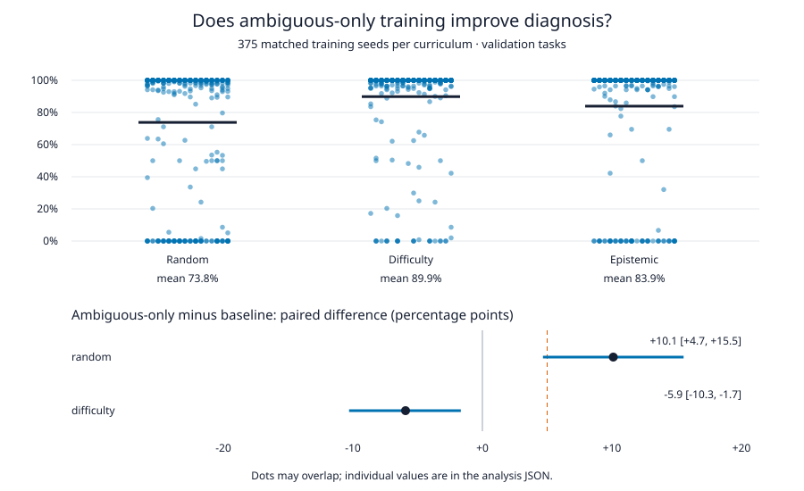

# Faultline

I built a small synthetic factory simulator to study whether reinforcement-learning agents investigate before repairing. **Training only on ambiguous faults beats random task sampling, but loses to difficulty-adaptive sampling** in my independent 375-seed comparison. The proposed advantage over both alternatives is ruled out—not merely left inconclusive.

Two hidden faults produce identical initial symptoms but need opposite repairs; advancing the factory and inspecting it distinguishes them ([generator](src/faultline/generation/diagnostic_pairs.py)). My graph encoder and recurrent policy learn with PPO and GAE, rewarded for production minus operating costs, not information gain ([trainer](src/faultline/training/ppo.py)). The [sampler](src/faultline/training/curriculum.py) compares three training distributions.

## Result: 1,125 trained policies

I fixed **375 matched training seeds, 500–874**, before training. Each run targets 30,000 decision steps and evaluates the same 128 validation base pairs. Diagnostic success requires advancing, obtaining informative inspection evidence, then making the correct repair on ambiguous tasks; guessing a repair is insufficient. The [analysis](artifacts/results/seed-confirmation-analysis.json) uses 10,000 bootstrap resamples over training seeds, not episodes. Poor learning runs remain included.

| Curriculum | Training tasks | Mean diagnostic success [95% interval] |
| --- | --- | --- |
| Random | 50/50 ambiguous/revealed | 73.8% [69.6%, 78.0%] |
| Difficulty | Failure-EMA adaptive mix | 89.9% [87.1%, 92.4%] |
| Epistemic | All ambiguous | 83.9% [80.3%, 87.4%] |

The paired Epistemic−Random difference is **+10.1 percentage points [ +4.7, +15.5 ]**; Epistemic−Difficulty is **−5.9 points [ −10.3, −1.7 ]**. Both intervals exclude zero in opposite directions. These are individual 95% intervals, not simultaneous intervals for a full curriculum ranking. Neither lies inside the specified ±5-point equivalence margin: I do not claim practical equivalence, or that either interval establishes a minimum five-point effect.



Each dot is one seed; overlapping dots are retained. Bars show means and paired intervals; the dashed line marks the +5-point superiority target. The [analysis script](tools/analyze_seed_comparison.py) checks result/configuration hashes, training budgets and full episode traces before recomputing scores.

My [pre-training plan](docs/seed-confirmation-plan.md) estimated half-widths below five points from an earlier replication. Observed half-widths were **5.43 points versus Random** and **4.31 versus Difficulty**: I missed the precision target for Random. I did not extend the cohort after seeing outcomes. The [earlier eight-seed study](artifacts/results/small-kill-v1-analysis.json) and [32-seed replication](artifacts/results/seed-comparison-analysis.json) were inconclusive and are not pooled here. This confirmation uses one PyTorch thread; earlier cohorts used more threads, so I do not assume identical arithmetic or trajectories across cohorts.

The confirmation used at most 32 Modal containers, each requesting one CPU core and 1 GiB, with no GPU. Its [conservative compute estimate](artifacts/results/seed-compute-costs.json) is **$3.3312**, or **$4.2829** including the earlier replication, pilots, capacity check and failed initial invocation. These are buffered compute estimates, not invoices; storage and egress are excluded. I retain all checkpoints remotely, with [hashes and locations](artifacts/results/seed-confirmation-checkpoints.json), available on request; no new cohort weights are added to Git.

## Reproduce the analysis

```bash
uv sync --python 3.11 --locked --extra dev --extra learning-cpu
uv run python tools/analyze_seed_comparison.py --protocol configs/evaluation/seed-confirmation.toml
git diff --exit-code artifacts/results  # no output: the committed analysis and figure reproduce
uv run pytest
```

These CPU-only commands use the [compressed original results and manifests](artifacts/results/seed-confirmation-runs.tar.gz); they do not retrain models or download checkpoints. The analysis took 43 seconds on a shared ARM64 server, and CI repeats it on every push. Retraining requires a Modal account and separately installed client; the [runner](tools/modal_seeds.py), pinned configuration and plan retain the training procedure.

## Limits and prior work

This is one synthetic task family, not an LLM or Factorio result. I evaluated validation only; the held-out test split remains untouched. Action masks simplify experiment design. Cue reliability and reward coefficients are absent from policy inputs, so this does not establish selective probing or cost adaptation. The earlier [counterfactual telemetry tests](artifacts/results/counterfactual-v1-analysis.json) concern older policies, not these new checkpoints.

I build on [Learning to Acquire Information](https://arxiv.org/abs/1704.06131), [causal meta-reinforcement learning](https://arxiv.org/abs/1901.08162), and [PAIRED](https://arxiv.org/abs/2012.02096); active diagnosis and value of information are established ideas. The useful contribution here is a reproducible comparison that rejects my original preferred curriculum claim.

Written with AI coding assistance.
